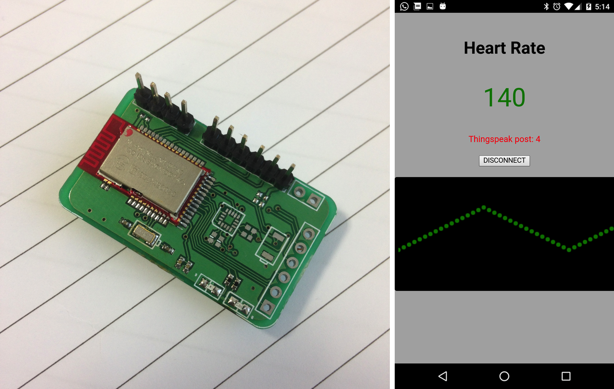

Construction of a **cordova** based cross-platform mobile app that displays *heart rate measurement* data sent
from a Nordic nRF51822 *device* via BLE, as well as periodically posts this data to *thingspeak.com*.

Assumes that nRF51822 is running the **ble_app_hrs** sample from Nordic.

Full article here:

http://electronut.in/nrf51-cordova/
